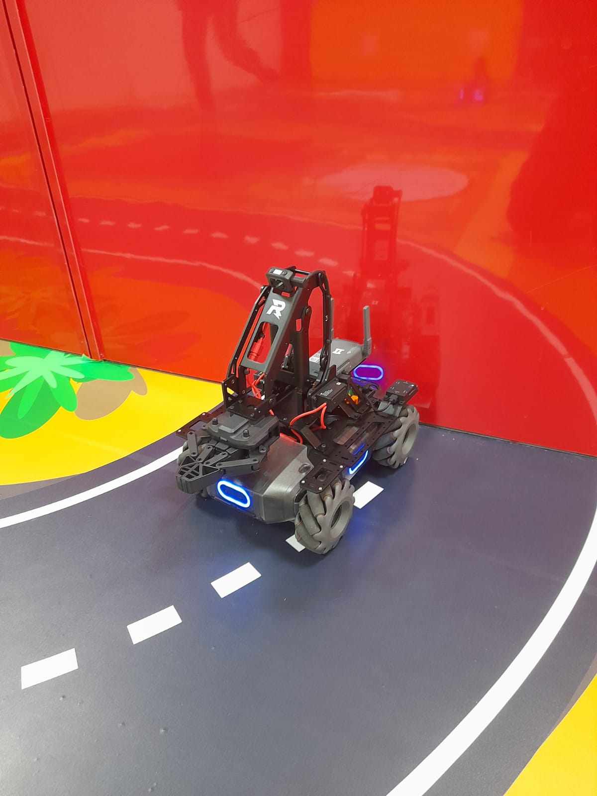
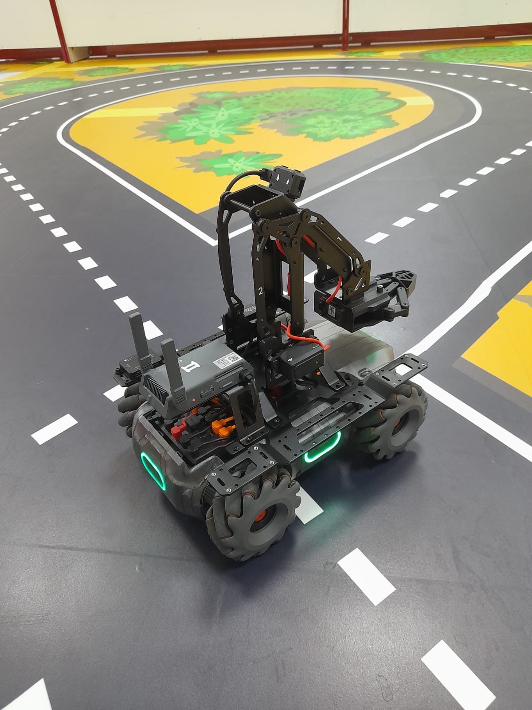

# MobileRobot-Openloopcontrol
## Aim:

To develop a python control code to move the mobilerobot along the predefined path.

## Equipments Required:
1. RoboMaster EP core
2. Python 3.7

## Procedure

Step1: Initiate the MobileRobot.
<br/>
Step2: Connect your PC with the MobileRobot.
<br/>
Step3: Open Python program.
<br/>
Step4: Program the movements of the robot using python code.
<br/>
Step5: Execute the python program.

## Program
```
from robomaster import robot
import time

if __name__ == '__main__':
    ep_robot = robot.Robot()
    ep_robot.initialize(conn_type="ap")
    ep_chassis = ep_robot.chassis
    ep_chassis.move(x=0.2, y=0, z=0, xy_speed=1).wait_for_completed()
    ep_chassis.move(x=0, y=0, z=-15, xy_speed=1).wait_for_completed()
    ep_chassis.move(x=0.4,y=0 ,z=0, xy_speed=1).wait_for_completed()
    ep_chassis.move(x=0, y=0, z=-20, xy_speed=1).wait_for_completed()
    ep_chassis.move(x=0.3, y=0, z=0, xy_speed=1).wait_for_completed()
    ep_chassis.move(x=0, y=0, z=-43, xy_speed=1).wait_for_completed()
    ep_chassis.move(x=1.9, y=0, z=0, xy_speed=1).wait_for_completed()
    ep_chassis.move(x=0, y=0, z=25, xy_speed=1).wait_for_completed()
    ep_chassis.move(x=0.5, y=0, z=0, xy_speed=1).wait_for_completed()
    ep_chassis.move(x=0, y=0, z=45, xy_speed=1).wait_for_completed()
    ep_chassis.move(x=1, y=0, z=0, xy_speed=1).wait_for_completed()
    ep_chassis.move(x=0, y=0, z=23, xy_speed=1).wait_for_completed()
    ep_chassis.move(x=0.9, y=0, z=0, xy_speed=1).wait_for_completed()
    ep_chassis.move(x=0, y=0, z=35, xy_speed=1).wait_for_completed()
    ep_chassis.move(x=1.2, y=0, z=0, xy_speed=1).wait_for_completed()
    ep_led = ep_robot.led
    for i in range(10):
        ep_led.set_led(comp="all",r=255,g=0,b=0,effect="on")   
        time.sleep(2)
        ep_led.set_led(comp="all",r=0,g=255,b=0,effect="on")
        time.sleep(2)
        ep_led.set_led(comp="all",r=0,g=0,b=255,effect="on")
        time.sleep(2)        
        ep_chassis.drive_speed(x=0,y=0,z=180)
    time.sleep(1)
    ep_robot.close()
```

## MobileRobot Movement Image:


## Initial position:

## final position:


## MobileRobot Movement Video:
Embed video here: 🎬🎬🎬https://youtu.be/dH8hXgzS__Y🎬🎬🎬 

## Result:
Thus the python program code is developed to move the mobilerobot in the predefined path.

```
Mobile Robotics Laboratory
Department of Artificial Intelligence and Data Science/ Machine Learning
Saveetha Engineering College
```
